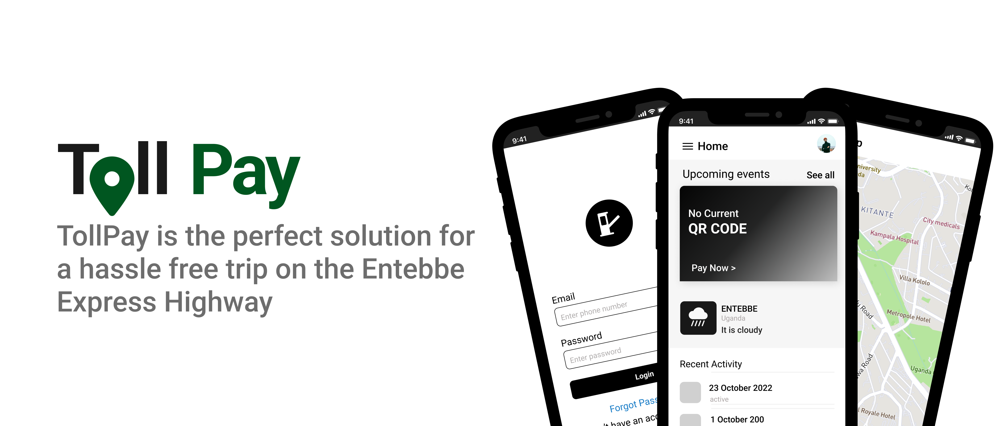

# Toll Pay

Table A: Group Members
| # | Names | Role |
| :--- | --- | --- |
| 1 | Kasasira Charles Derrick | - |
| 2 | Lukyamuzi Akram | - |
| 3 | Nakuwanda Hellen Bridget | - |
| 4 | Langalafa Gideon Ohure | - |
| 5 | Tangaya Daphine Damalie | - |

## Problem Statement
---

TRoad tolling is a method of raising revenue form transport infrastructure through imposing a charge or fee on the vehicle. In Uganda today, we have one toll road at the Entebbe express highway and from the UNRA toll poll section 10.7 the allowed method of payment is by cash and credit cards, operator cards, mobile money and others. Payment by cash leads to too much waste of time at the toll and in some extreme cars there is a holder while wanting for balance at this toll pay.

## Our Solution (Toll Pay)
---
According to UNRA, The payment method adopted shall be custom friendly and this is why we have built an easy to use mobile application which shall help in the collection of toll payment. The system will be accessible via a simple mobile application Toll Pay which has an ease to use interface and a great user interface. The system also uses dynamic QR codes which are secure and cannot be reused once expired. We are happy to say that the system will increase the willingness to Pay at the Entebbe Express Highway.

Table B: Road Toll User Fees
| Vehicle Type | Vehicle Class Descript | Toll Fees Per Trip |
| --- | --- | --- |
| Class 1 | Motorcycles with 400cc and above | 3,000 |
| Class 2 | Light Vehicles with or without tailes | 5,000 |
| Class 3 | Medium Goods vehicles 2 or 3 axles | 10,000 |
| Class 4 | Large Goods vehicles and large buses with 4 or 5 axles | 15,000 |
| Class 5 | Large Goods vehicles with 6 and more axles | 18,000 |

